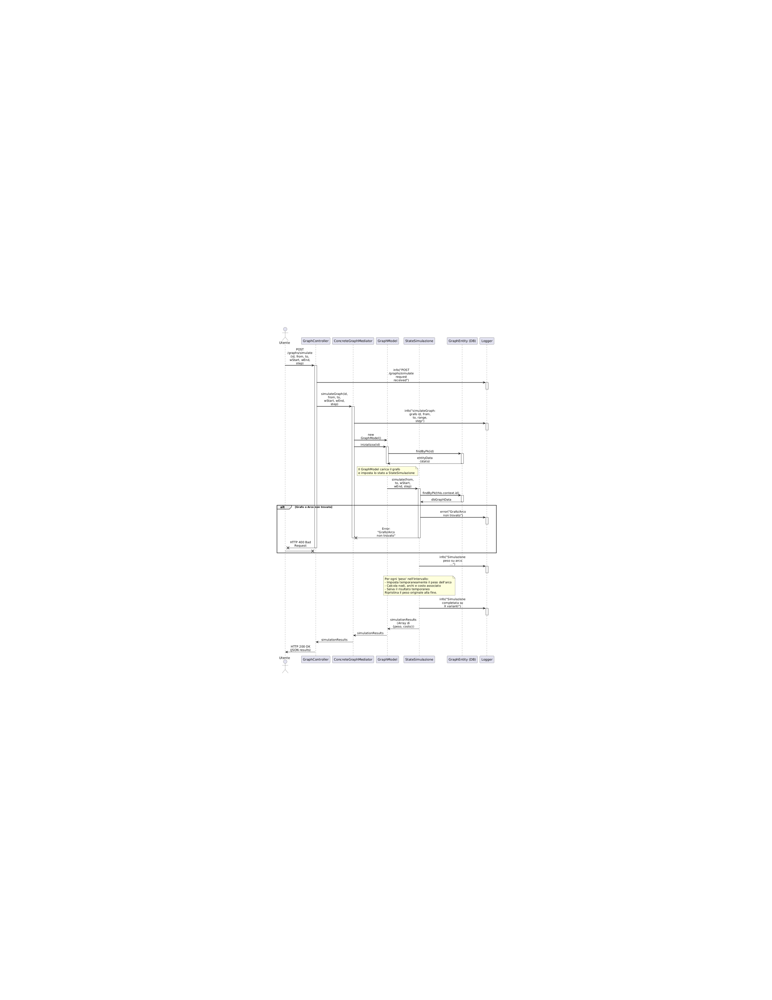

# Programmazione_avanzata
## Anno Accademico
**2024/2025**

##  Obiettivo del Progetto
Questo progetto backend ha l'obiettivo di fornire un'infrastruttura robusta e sicura per la **gestione e valutazione di modelli di ottimizzazione su grafo**, con particolare attenzione al contributo collaborativo degli utenti (crowd-sourcing), all'autenticazione tramite **JWT** e all'utilizzo di **design pattern** moderni per garantire estendibilità e manutenzione.

##  Funzionalità Principali

###  Creazione e Validazione dei Modelli a Grafo
- Definizione di nodi e archi.
- Calcolo del costo in token (0.20 per nodo, 0.01 per arco).
- Validazione del credito utente prima della creazione.

###  Autenticazione e Gestione Utenti
- JWT obbligatori per tutte le richieste.
- Supporto per ruoli (utente e admin).
- Verifica e gestione del numero di token residui.

###  Gestione del Ciclo di Vita del Modello (Pattern State)
- Gli oggetti grafo transitano in stati (`Creato`, `Modificato`, `Eseguito`).
- Ogni stato impone vincoli sulle operazioni eseguibili.

###  Esecuzione dei Modelli
- Calcolo del percorso ottimo tramite l’algoritmo di Dijkstra (`node-dijkstra`).
- Output del percorso, costo e tempo computazionale.

###  Simulazione delle Variazioni sui Pesi
- Specifica di peso iniziale, finale e passo.
- Simulazioni multiple e selezione automatica del miglior risultato.

### Versionamento e Tracciabilità
- Ogni aggiornamento dei pesi genera una nuova versione.
- Filtro per data, numero di nodi e numero di archi.

###  Gestione degli Errori
- Middleware centralizzati per la validazione e gestione delle eccezioni.

###  Ricarica dei Token (Admin only)
- End-point protetto per la ricarica crediti via email utente.

---

##  Architettura & Design Pattern Utilizzati

-  **Mediator**: coordina le interazioni tra controller e modelli.
-  **Singleton**: gestione centralizzata di configurazioni (es. accesso DB).
-  **State**: implementazione dello stato dinamico dei modelli.
---
# Progettazione
##  Lo schema E-R 
 
 ##  Analisi dei requisiti 

##  Requisiti Funzionali

- **RF1- creare grafo**
  - L'utente auteniticato può creare un grafo se ha credito sufficilente.
  
- **RF2- eseguire un grafo**
  - L'utente auteniticato può eseguire un grafo se ha credito sufficilente per trovare il migliore percorso.

- **RF3- aggiornare peso**
  - L'utente auteniticato può aggiornare il peso di un'arco.

- **RF4- simulare un arco**
  - L'utente auteniticato può simulare il peso di un'arco e vedendo come cambia il percorso migliore.

- **RF5- visualizzare grafi**
  - L'utente auteniticato può visualizzare tutti i grafi nel dataset.

- **RF6- ricaricare credito**
  - L'admin auteniticato può caricare l'emai di un utente.
- **RF7- elenco versioni grafi**
  - L'utente auteniticato può visualizzare tutti i versioni vecchie di un determinato grafo.
---

##  Requisiti Non Funzionali

- **RNF1- Autenticazione JWT**
  - Il sistema richiede l'autenticazione degli operatori attraverso JSON Web Token (JWT) per garantire un accesso sicuro e controllato
- **RNF2- Validazione delle Richieste**
  - Il sistema deve effettuare la validazione delle richieste degli operatori per garantire che i dati forniti siano conformi ai requisiti.

- **RNF3- Tecnologia**
Il sistema deve utilizzaare tecnologie specifiche (Node.js, Express,TypeScript,DBMS) per implementare in modo efficiente i requisiti funzionali e non funzionali specificati.


- **RNF4- Testabilità**
  - Struttura del codice pensata per testing unitario e di integrazione (es. Jest, Postman).

---
## Diagrammi UML
##  Attori 
 
 ##  Casi d'uso 
 


---
##  Diagramma delle classi
 

---
##  Diagrammi di sequenza
1. **Creare grafo**
   
2. **Modificare grafo**
   
3. **Esecuzione grafo**
   
4. **Simulazione grafo**
   
5. **ricarica grafo**
   
---

##  Test del progetto con Postman
Di seguito alcuni esempi di test effettuati tramite Postman, con immagini a supporto.

1. **Autenticazione utente con JWT rotta(http://localhost:3000/users/admin/recharge)**
   

2. **Autenticazione utente con JWT rotta(http://localhost:3000/users/admin/recharge)**
   

3. **Autenticazione utente con JWT rotta(http://localhost:3000/users/admin/recharge)**
   

4. **Creazione di un grafo(http://localhost:3000/graphs)**
   

5. **Esecuzione di un grafo(http://localhost:3000/execute)**
   

6. **Simulazione di un grafo (http://localhost:3000/simulate)**  
  


7. **Modificare il peso di un arco di un grafo (http://localhost:3000/update-weight)**  
  


# Istruzioni di Installazione
1. Clone repository.
2. Build delle Immagini Docker:  
``` docker-compose build ```

3. Avvio del Progetto:   
``` docker-compose up```
4. Accesso al Progetto: Una volta avviato, il progetto sarà accessibile all'indirizzo ``` http://localhost:3000```
